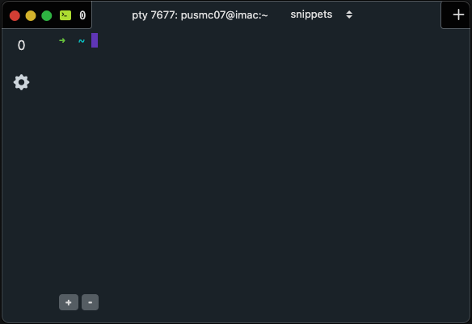

# NG-Xterm

[](https://angular.io/) [](https://electronjs.org/)




As a Linux and Mac OS user (mostly Mac), I spend a lot of time at the terminal. While there are several amazing terminal emulators available such as **Hyper** and **iTerm2**, I wanted to build my own.

## Adding and Removing Tabs


## Adding and Removing Tab Panels


### Currently Versions:

* Angular v12.0.4
* Electron v13.1.1
* Electron Builder v22.10.5

### Gotchas

* Hot reload only pertains to the renderer process. The main electron process is not able to be hot reloaded, only
restarted.
  

* Angular 11.x CLI needs Node 10.13 or later to work correctly.
If you want to generate Angular components with Angular-cli , you **MUST** install `@angular/cli` installed
on your system. Please see [Angular-cli documentation](https://github.com/angular/angular-cli) for further assistance.`

### Getting Started

#### Clone this repository locally:
```shell
git clone https://github.com/payneusmc07/ng-xterm.git
```


#### Install dependencies with yarn or npm:
```shell
yarn install
````

### Words of warning
Node-pty (what is used by ng-xterm to spawn terminal sessions) is what is known as a Native Module.
This means it is written in C/C++ and complied for use with Node/Electron. Native Modules can be very finicky, 
and Node-pty is notorious for causing development headaches.

If you try to build/run ng-xterm and you see errors in the developer tools which say something
along the lines of:

```shell
Cannot find file "../Debug/node-pty.node"
```

then node-pty needs to be rebuild for the current version of Node/Electron you are using.
There are two scripts in package.json to help accomplish this.

* **postinstall**: Utilizes Electron Builder to rebuild any Native Modules, this is automatically run
  after installing/removing dependencies.


* **rebuild:pty**: Uses Electron Rebuild.


* there is also a third (but not as effective method) to rebuild Node-pty, using NPM to rebuild the associated binary
files. To use NPM, just run:
  
```shell
npm rebuild node-pty --update-binaries
```

* To make life easier for future users/developers, I included the rebuild:pty in the post install script 
so Electron Rebuild is automatically run after each dependency update. I did this because
  during the course of developing ng-xterm, I  found when using "brand new" versions of Electron,
  (such as 13.0+) that Electron Builder did not always get the job done for rebuilding Node-pty. 

# Important Commands

#### For IntelliJ/Webstorm users
The included .run folder contains pre-configured scripts which you _should_ be able
to load and run without any configuration. These scripts contain the needed environment variables
to develop NG-Xterm.

#### For Non IntelliJ/Webstorm users
The included .run folder also contains VSCode tasks for running in development
and building NG-Xterm for production.

#### If you are not using the included script files

You will need to set your environment variables manually.


#### Install and rebuild dependencies
```shell
yarn init
```

#### Run the main and renderer process in development mode

**Please make sure to set the following environment variables if you are not using the included scripts.**
* DEV_URL=http://localhost:4200
* NODE_ENV=development

```shell
yarn dev
```

#### Build the renderer (Angular) process. Your built files are in the /dist folder.

```bash
yarn build:prod
```

#### Build the main process only.
**Note: Please make sure you have run build:prod 
as Electron will look for the static index.html file.**

```shell
yarn build:electron-only
```

#### Build only the main process in production mode
**please make sure to set the following environment variable if you are not using the included scripts.**
* NODE_ENV=production
```shell
yarn build:electron-only:all
```

#### Build NG-Xterm for all platforms, but nothing is published to Git.
**please make sure to set the following environment variable if you are not using the included scripts.**
* NODE_ENV=production
```shell
yarn build:final:all-platforms:no-publish
```

#### Build NG-Xterm for all platforms, and the completed app is published to Git.

```shell
yarn build:final:all-platforms:publis
```

#### Generate documentation
```bash
yarn compodoc
```

### Documentation

It has always been a pet peeve of mine when a program or code base is not properly documented \(**you know who you are**\).

With this in mind, I know some of you may feel the amount of documentation/comments I included is a bit excessive, but I would rather have "too much" and sleep better knowing everything is properly documented.

* The majority of the documentation was generated with the `compodoc` package.
* The code is also heavily commented.

# Common Questions

* Why are some of the function names so long?

Those of you familiar with Objective C/Swift background know how "verbose" the function names/parameters can be. 
  And seeing as I am also an Objective C/Swift, I brought that convention over with me, mostly
out of habit, but I feel it makes it easier to understand what the code is doing
since some of its functionality is described in the function/method name.


* Why are certain class members not marked as private when they
  can or should be?

Due to the nature of the new Angular compiler and rendering system (Ivy),
variables that will be used in the html template cannot be marked as private,
since they cannot be resolved by the compiler. An example of this can be seen
in the code snippet from the app-root component. Since the class member
**idFromTab: number | string** is used in the html template, it must remain public.

```ts

/** The id of the currently selected tab in the tabs component. */
idFromTab: number | string

/**
 * Angular will throw the following error if idFromTab 
 * is made private.
 *
 * Private field idFromTab cannot be resolved from the
 * component template when using the AOT compiler
 * */
private idFromTab: number | string


```

```html
<!-- Since tabID is actively used in the template, it MUST be public -->
<ng-xterm-app-topbar [tabID]="idFromTab"></ng-xterm-app-topbar>
<ng-xterm-tabs (tabID)="setID($event)"></ng-xterm-tabs>
```

**Why are public classes/functions not explicitly marked as public?**

By default, methods and classes are public in Typescript, so I did not feel
the need to repeat the obvious. Aside from that, when you are working with classes
which have a lot of memeber methods, it can become easy to mistake public for private if you are not paying attention.

**Why is eslint not installed?**

Seeing as NG-Xterm was developed soley by me, I did not feel adding something which monitors my
already consistent coding style was needed.

# Forms
## How the various settings forms work.

The code snippet below was taken from the ng-xterm-tab-settings component.
Since Reactive forms in Angular can be a bit confusing, I thought I would provide
a bit of a break down as to how the various forms were configured, and how each setting
is retrieved from the terminal settings store.

Please note, not all comments or functions will be a complete refection of the actual code.
This page is meant as more of a walkthrough/demo.

```ts
import { Component, OnInit } from "@angular/core"
import { FormControl, FormGroup } from "@angular/forms"
import { SettingsService } from "@shared/services"
import { Settings } from "@shared/utils"

@Component({
	selector: "ng-xterm-tab-settings",
	templateUrl: "./tab-settings.component.html",
	styleUrls: ["./tab-settings.component.scss"]
})

/** The form which modifies any settings related to the ng-xterm-tab-settings component */
export class TabSettingsComponent implements OnInit {

	/** Define the basic form which modifies any settings related to the ng-xterm-tab-settings component */
	tabSettingsForm: FormGroup

	/**
	 * A string value which will represent the preferred background color
	 * for the UI tabs. This value will be retrieved from the settings store.
	 * */
	tabBackgroundColor: string
	
	/** By "declaring" the various services used by this component in the constructor, 
	 * we allow for the Angular dependency injection (DI) mechanisms to properly configure
	 * and instantiate the service class(es) for us. When using DI, we DO NOT instantiate 
	 * the service class(es) with the "new" keyword. 
	 * */
	constructor(private readonly settingsService: SettingsService) {}

	/**
	 * Since Electron Store returns an "unknown" value, each retrieved settings
	 * must be type cast to a specific value. Otherwise, Typescript will throw error code
	 * TS2322: Type 'unknown' is not assignable to type '[stored value]'.
	 * */
	ngOnInit() {
		// DO NOT DO THIS!
		this.settingsService = new SettingsService()
		
		// retrieve the background color from the settings store. and type cast it to a string
		this.tabBackgroundColor = this.settingsService.getItem( Settings.TAB_BG_COLOR) as string
		
		this.tabSettingsForm = new FormGroup({
			// the name of the form control: instantiate a new FormControl with an optional default value
			"tab-background": new FormControl(this.tabBackgroundColor),
		})
	}
}
```

### A Big Thank You To

* Vercel for giving us Hyper, which served as a large inspiration for this project.

* maximegris of Github for the awesome boilerplate/starting template
* [https://github.com/maximegris/angular-electron.git](https://github.com/maximegris/angular-electron.git)

* Google for the Angular platform.

* And the Electron team for making such a powerful yet easy to use platform.
